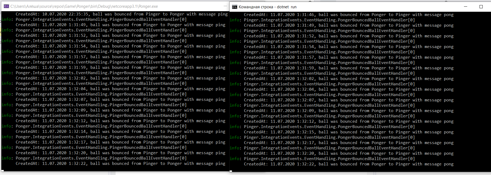
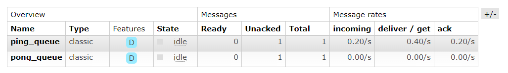
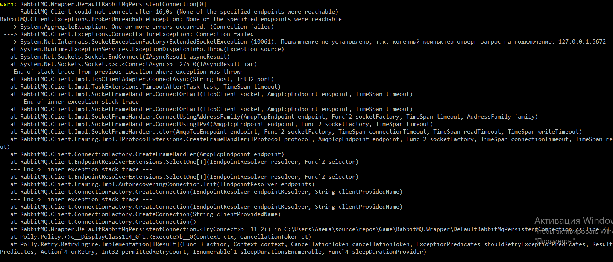

Result:
1. Pinger console application listens to ping_queue, writes to pong_queue.
2. Ponger console application listens to pong_queue, writes to ping_queue

At the picture below you can see queues: ping_queue and pong_queue;

Also, during connection to rabbitmq you have some retry attempt if the connection is not established:

You can start rabbitmq server by docker and next command:

docker run -d --hostname my-rabbit --name Rabbit -p 15672:15672 -p 5672:5672 rabbitmq:3-management